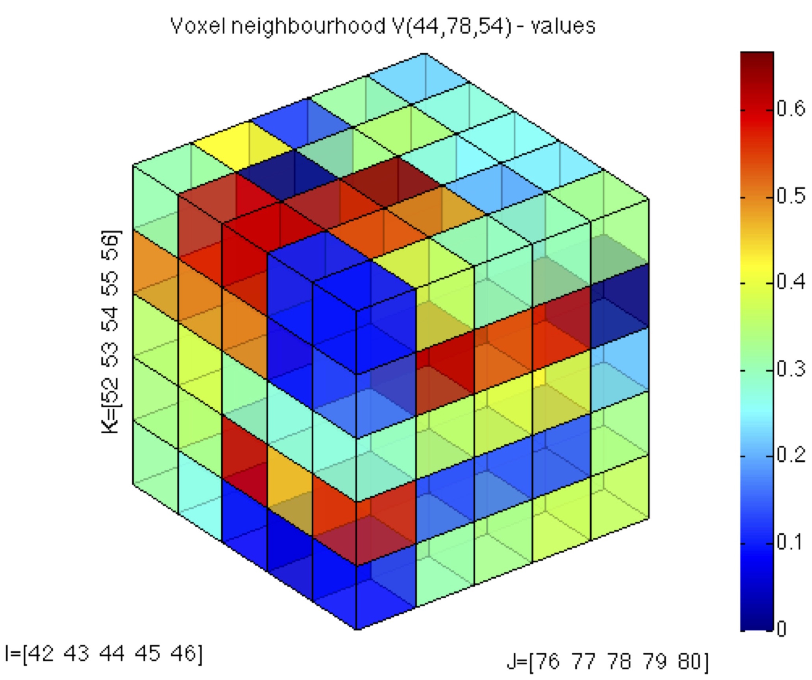
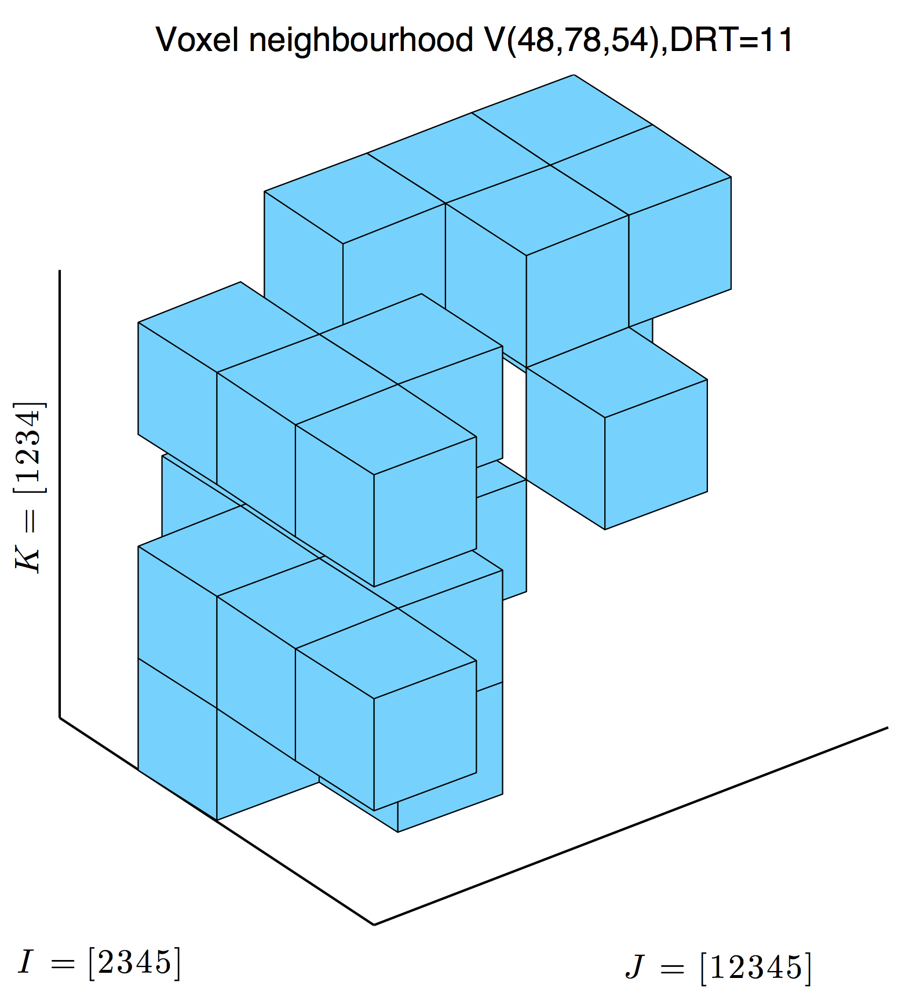
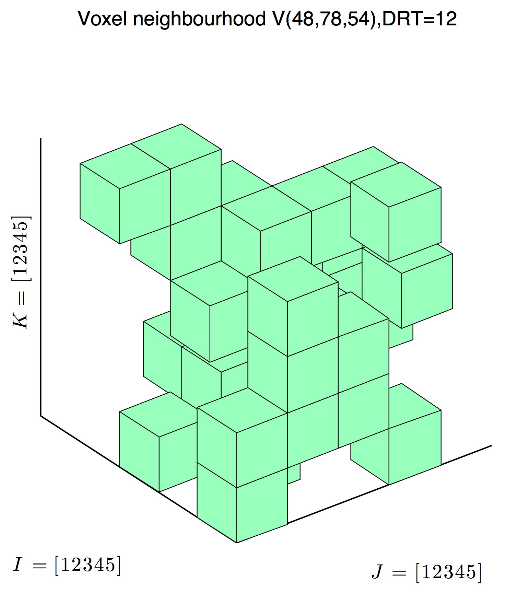
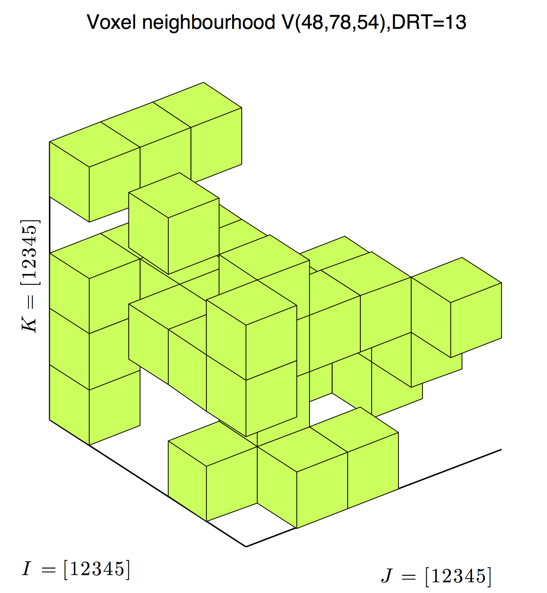

# mainExtractorSPESubvolume

This script is simply to analyze local neighborhoods of a cell based on the concept of [Moore's neighborhood](http://en.wikipedia.org/wiki/Moore_neighborhood). The user enters with the central cell coordinates _(ic,jc,kc)_ and the radius _P_ of the neighborhood, so having a domain _V(ic,jc,kc;P)_. Then, by choosing one of the scalar fields available for plotting, a 3D view is generated. 

Below, some examples for _V(44,78,54;2)_ are depicted:

--
Here, the labels I,J,K identify the cuboid ranges in the global field coordinates.

### Porosity field 

--
Here, the labels I,J,K identify which layers contain at least one voxel in local coordinates.

### DRT 11 cells 

--
### DRT 12 cells 

--
### DRT 13 cells 

